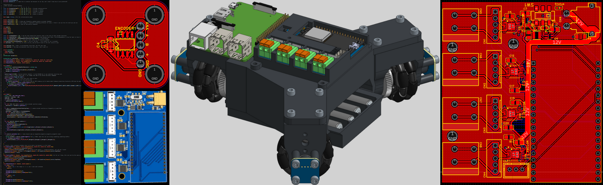
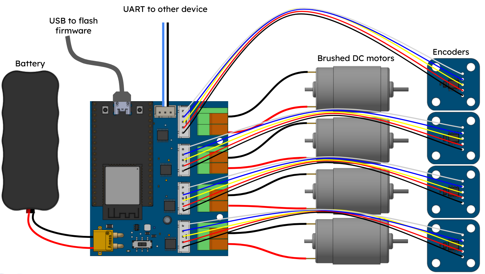

# Motor-Driver

A ~~cheap~~ good value ESP32 operated brushed DC motor driver with encoders for robotics, and a fun robot to test it out!

### What actually is this??
This is a motor brushed DC motor controller which can do plain control, or position/velocity control using high resolution encoders. It is based on an ESP32 and supports 6V-9.6V, with 2A maximum current per motor. There is a 3 wheeled robot which will be controlled by it, and I hope to have precise control over it.

### Why did I make this?
I have had several ideas where I thought "It would be cool to make \_\_\_\_," but then I think "Well, I don't have the hardware to do it, and the existing solutions are expensive." The goal of this is to make it so that I, and ideally anyone else, can able to skip the step figuring out motor contolling or of spending ridiculous amounts on a motor controller, so they can get to making!

### How to use this?
Order the pcbs from JLCPCB. Assemble them, plug things in (battery voltage must be 6-10.8V). Flash the firmware to your ESP32 DEVKITC, and send signals to it via the UART port. The 3 control modes are manual, PositionPID and VelocityPID, and each motor can be set to one. Once per boot, you have to establish what mode each channel is on. Data should come as "INIT:mode0,p0,i0,d0,mode1,p1,i1..." where modes; 1=manual,2=position,3=velocity, and p i d are the constants in a PID controller (PID must be passed no matter what, just send zeroes for manual). Message me on slack, (U081ZD4EP47) or discord (dhmango) if you have any questions. THIS PROJECT IS UNTESTED RIGHT NOW

[Onshape document](https://cad.onshape.com/documents/3ae1449a794a394dc74e0043/w/87052e9bd5ec64c19fb2a65c/e/91d8b37aaee0195111e8b5e1)
|Link                                                                                                                                                                                                                                                                                                                                                                                                                                                                                                                                                                                                                                                                                    |What                |Price |Quantity|Total |Running|
|----------------------------------------------------------------------------------------------------------------------------------------------------------------------------------------------------------------------------------------------------------------------------------------------------------------------------------------------------------------------------------------------------------------------------------------------------------------------------------------------------------------------------------------------------------------------------------------------------------------------------------------------------------------------------------------|--------------------|------|--------|------|-------|
|JLCPCB.com                                                                                                                                                                                                                                                                                                                                                                                                                                                                                                                                                                                                                                                                              |Main PCB (x2)       |$32.43|1       |$32.43|$32.43 |
|JLCPCB.com                                                                                                                                                                                                                                                                                                                                                                                                                                                                                                                                                                                                                                                                              |Encoder PCB (x5)    |$31.20|1       |$31.20|$63.63 |
|https://www.aliexpress.us/item/2251832823106807.html?spm=a2g0o.productlist.main.37.5e2a35b4NZkcpz&algo_pvid=ded1f051-28f4-440f-a600-fae4e345302c&algo_exp_id=ded1f051-28f4-440f-a600-fae4e345302c-33&pdp_ext_f=%7B%22order%22%3A%22336%22%2C%22eval%22%3A%221%22%2C%22fromPage%22%3A%22search%22%7D&pdp_npi=6%40dis%21USD%212.56%212.56%21%21%212.56%212.56%21%402101e07217747610505304735e2d5b%2167102362981%21sea%21US%216384082601%21X%211%210%21n_tag%3A-29919%3Bd%3A725973a5%3Bm03_new_user%3A-29895&curPageLogUid=oYuyjdCY5rv8&utparam-url=scene%3Asearch%7Cquery_from%3A%7Cx_object_id%3A33009421559%7C_p_origin_prod%3A                                                         |JST XH kit          |$2.56 |1       |$2.56 |$66.19 |
|https://www.aliexpress.us/item/3256806969799753.html?spm=a2g0o.productlist.0.0.7dae7a70k6UttD&gatewayAdapt=glo2usa                                                                                                                                                                                                                                                                                                                                                                                                                                                                                                                                                                      |Encoder wire        |$3.56 |1       |$3.56 |$69.75 |
|https://www.aliexpress.us/item/3256807777136797.html?spm=a2g0o.productlist.0.0.17c32676w0kZpc&gatewayAdapt=glo2usa                                                                                                                                                                                                                                                                                                                                                                                                                                                                                                                                                                      |ESP32-DEVKITC-32D   |$4.89 |1       |$4.89 |$74.64 |
|https://www.aliexpress.us/item/3256804774953787.html?spm=a2g0o.productlist.main.5.35fc53f9A0vlCm&algo_pvid=c926fb6c-2786-4cfd-bc04-02762055f234&algo_exp_id=c926fb6c-2786-4cfd-bc04-02762055f234-4&pdp_ext_f=%7B%22order%22%3A%221471%22%2C%22eval%22%3A%221%22%2C%22fromPage%22%3A%22search%22%7D&pdp_npi=6%40dis%21USD%211.45%211.45%21%21%211.45%211.45%21%40210318a717747641208286913ee202%2112000031165131182%21sea%21US%216384082601%21X%211%210%21n_tag%3A-29919%3Bd%3A725973a5%3Bm03_new_user%3A-29895&curPageLogUid=z3tkWMShuraF&utparam-url=scene%3Asearch%7Cquery_from%3A%7Cx_object_id%3A1005004961268539%7C_p_origin_prod%3A                                               |XT30                |$1.82 |1       |$1.82 |$76.46 |
|https://www.lcsc.com/product-detail/C2898709.html                                                                                                                                                                                                                                                                                                                                                                                                                                                                                                                                                                                                                                       |Terminals           |$0.18 |6       |$1.07 |$77.53 |
|https://www.lcsc.com/product-detail/C2906280.html                                                                                                                                                                                                                                                                                                                                                                                                                                                                                                                                                                                                                                       |switch              |$0.07 |10      |$0.66 |$78.18 |
|https://www.digikey.com/en/products/detail/radial-magnets-inc/8995/5126077                                                                                                                                                                                                                                                                                                                                                                                                                                                                                                                                                                                                              |12 sense magnets    |$11.16|1       |$11.16|$89.34 |
|https://www.aliexpress.us/item/3256809444780035.html?spm=a2g0o.productlist.main.37.7a271308pb7Zav&algo_pvid=ea311d25-e068-491b-901b-38da25729366&algo_exp_id=ea311d25-e068-491b-901b-38da25729366-32&pdp_ext_f=%7B%22order%22%3A%2226%22%2C%22eval%22%3A%221%22%2C%22fromPage%22%3A%22search%22%7D&pdp_npi=6%40dis%21USD%212.26%211.98%21%21%2115.49%2113.55%21%402101e83017736823217475588e2f7e%2112000049688777163%21sea%21US%216384082601%21X%211%210%21n_tag%3A-29919%3Bd%3A725973a5%3Bm03_new_user%3A-29895%3BpisId%3A5000000202470703&curPageLogUid=RYoULINjziqg&utparam-url=scene%3Asearch%7Cquery_from%3A%7Cx_object_id%3A1005009631094787%7C_p_origin_prod%3A#nav-specification|390 motor           |$2.06 |3       |$6.18 |$95.52 |
|https://www.aliexpress.us/item/3256806946476761.html?spm=a2g0o.productlist.main.17.41464df5s4CBDA&algo_pvid=63226970-0f66-4458-950c-aa5d898eee16&algo_exp_id=63226970-0f66-4458-950c-aa5d898eee16-16&pdp_ext_f=%7B%22order%22%3A%22190%22%2C%22eval%22%3A%221%22%2C%22fromPage%22%3A%22search%22%7D&pdp_npi=6%40dis%21USD%212.58%212.58%21%21%212.58%212.58%21%402103123917736836925763746ed214%2112000039515228257%21sea%21US%216384082601%21X%211%210%21n_tag%3A-29919%3Bd%3A725973a5%3Bm03_new_user%3A-29895&curPageLogUid=jR4UETu2KmfE&utparam-url=scene%3Asearch%7Cquery_from%3A%7Cx_object_id%3A1005007132791513%7C_p_origin_prod%3A                                              |0.5m big gear       |$3.65 |3       |$10.95|$106.47|
|https://www.aliexpress.us/item/3256804883804669.html?spm=a2g0o.productlist.main.1.4d44SQ35SQ35jX&algo_pvid=e7cfb3ae-77fc-4ca6-bc9d-b017ef91e79c&algo_exp_id=e7cfb3ae-77fc-4ca6-bc9d-b017ef91e79c-0&pdp_ext_f=%7B%22order%22%3A%2246392%22%2C%22eval%22%3A%221%22%2C%22fromPage%22%3A%22search%22%7D&pdp_npi=6%40dis%21USD%211.31%211.25%21%21%211.31%211.25%21%402101eede17736907091068578e2b80%2112000031519353259%21sea%21US%216384082601%21X%211%210%21n_tag%3A-29919%3Bd%3A725973a5%3Bm03_new_user%3A-29895&curPageLogUid=gZjwlIQoezFf&utparam-url=scene%3Asearch%7Cquery_from%3A%7Cx_object_id%3A1005005070119421%7C_p_origin_prod%3A                                              |m2.5 flat screws    |$1.32 |1       |$1.32 |$107.79|
|https://www.gobilda.com/1516-series-8mm-rex-standoff-m4-x-0-7mm-threads-43mm-length-4-pack/                                                                                                                                                                                                                                                                                                                                                                                                                                                                                                                                                                                             |wheel shafts        |$4.12 |1       |$4.12 |$111.91|
|https://www.gobilda.com/48mm-omni-wheel-8mm-rex-bore-50a-durometer/                                                                                                                                                                                                                                                                                                                                                                                                                                                                                                                                                                                                                     |omni wheels         |$12.74|3       |$38.23|$150.14|
|https://www.aliexpress.us/item/3256804232590742.html?spm=a2g0o.productlist.main.3.26518MHU8MHUx1&algo_pvid=132fa547-a8a9-4640-98fd-83e2d621bd77&algo_exp_id=132fa547-a8a9-4640-98fd-83e2d621bd77-2&pdp_ext_f=%7B%22order%22%3A%22766%22%2C%22eval%22%3A%221%22%2C%22fromPage%22%3A%22search%22%7D&pdp_npi=6%40dis%21USD%211.43%211.43%21%21%211.43%211.43%21%4021032f3717736961138844579e0f3c%2112000029118422405%21sea%21US%216384082601%21X%211%210%21n_tag%3A-29919%3Bd%3A725973a5%3Bm03_new_user%3A-29895&curPageLogUid=pBxPgcYREOuY&utparam-url=scene%3Asearch%7Cquery_from%3A%7Cx_object_id%3A1005004418905494%7C_p_origin_prod%3A                                                |0.5m 10t pinion gear|$1.50 |3       |$4.50 |$154.64|

Made by a 15 year old (my first real project!)
